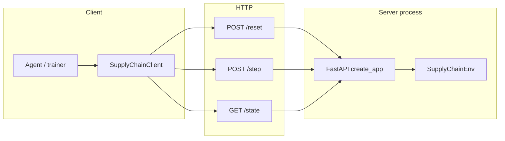

# Debug guide: code flow, modules, and operations

This document is for engineers who need to **trace execution**, **reason about scale and caching**, and **diagnose bad data or broken agent–environment contracts**. It complements `README.md` (product and RL overview).

---

## 1. End-to-end code flow

### 1.1 High-level picture



- **Single-process mode:** You can skip HTTP and call `SupplyChainEnv.reset` / `step` directly (same logic as inside the server).

### 1.2 Server request path (when `openenv-core` is installed)

1. **Uvicorn** loads `hackathon.server.app:app` (or `server.app:app` in some Docker layouts).
2. **`create_app(SupplyChainEnv, AgentAction, AgentObservation, ...)`** (from `openenv.core...`) constructs a **singleton** environment instance and registers routes (`/reset`, `/step`, `/state`, `/schema`, `/ws`, etc.—exact set depends on OpenEnv version).
3. **`POST /reset`** parses JSON body → `SupplyChainEnv.reset(**kwargs)` → returns an observation (Pydantic `model_dump()` to JSON).
4. **`POST /step`** parses `action` dict → `AgentAction(**action)` → `SupplyChainEnv.step(action)` → JSON with `observation`, `reward`, `done` (shape may be nested depending on server adapter).
5. **`GET /state`** returns `env.state.model_dump()`.

### 1.3 One `step()` inside `SupplyChainEnv` (ordered)

These run in sequence in `step()` (`server/hackathon_environment.py`):

| Order | What runs | Purpose |
|------:|-----------|---------|
| 1 | Guard if episode already `horizon_reached` | Idempotent terminal behavior |
| 2 | `step_count += 1` | Advance calendar day |
| 3 | `_handle_news_events()` | Expire/tick/start random news events |
| 4 | `_receive_inbound_shipments()` | Decrement shipment ETAs, receive into inventory |
| 5 | `_serve_existing_backlog()` | Retailers clear backlog from on-hand stock |
| 6 | `_sanitize_action(action)` | Clip orders, normalize shipping 0/1, update days-since-order |
| 7 | `_register_orders(...)` | Add orders to per-node, per-product, per-method backlogs |
| 8 | `_sample_disruption_link()` | Optional stochastic link disruption (`hard`) |
| 9 | `_dispatch_replenishment_orders()` | Move stock from upstream, create pipeline shipments, carbon |
| 10 | `_sample_customer_demand(day)` | 12 stochastic demands |
| 11 | `_serve_customer_demand(...)` | Fill from retailer inventory, grow backlog |
| 12 | Loop: `_update_forecast`, append `recent_customer_demand` | Per-stream forecast + history |
| 13 | Update `_fuel_price_multiplier` | Bounded random walk |
| 14 | `_compute_reward_terms(...)` | Costs, bonus, clip to [-1,1] |
| 15 | Update `SupplyChainState` (totals, fill rate, regime, …) | Episodic aggregates |
| 16 | `_build_observation(...)` | Flatten tensors for API |

**Reset path:** `reset()` re-seeds RNG (if seed given), reloads difficulty config, rebuilds inventory/pipelines/backlogs/forecasts/events, resets state, returns `_build_observation(..., reward=0, metadata={"status":"ready"})`.

---

## 2. File-by-file reference

Paths are relative to the `hackathon/` package directory unless noted.

### 2.1 `openenv.yaml`

- **Role:** OpenEnv manifest (name, runtime, `app` entrypoint, port).
- **Functions:** None; declarative config for `openenv push` / tooling.

### 2.2 `pyproject.toml`

- **Role:** Package metadata, dependency on `openenv-core[core]`, optional `dev` (`pytest`) and `train` (`torch`, `numpy`) extras, setuptools `package-dir` mapping for `hackathon`, `hackathon.server`, `hackathon.train`.
- **Functions:** None.

### 2.3 `uv.lock`

- **Role:** Locked dependency versions for reproducible installs.
- **Functions:** None.

### 2.4 `__init__.py` (package root)

- **Exports:** `SupplyChainClient`, `AgentAction`, `AgentObservation`, `SupplyChainState`.
- **Functions:** None (import surface only).

### 2.5 `_compat.py`

- **Role:** Bridge to **OpenEnv** types and HTTP app factory; **fallback** implementations if `openenv` is not importable (minimal FastAPI app for local smoke tests).

| Symbol / function | Purpose |
|-------------------|---------|
| `Action`, `Observation`, `State` | Pydantic bases (fallback) or re-exports from OpenEnv |
| `Environment` | Abstract base: `reset`, `step`, `state` |
| `StepResult` | Dataclass: `observation`, `reward`, `done` |
| `EnvClient` | Generic HTTP client: `reset`, `step`, `state` via `_request` |
| `EnvClient.reset` | `POST /reset`, parses payload into observation |
| `EnvClient.step` | `POST /step` with JSON action |
| `EnvClient.state` | `GET /state` |
| `EnvClient._request` | `urllib` JSON HTTP, 30s timeout, raises on HTTP error |
| `create_app` (fallback only) | Builds FastAPI with `/health`, `/reset`, `/step`, `/state` using a **single global** `env` instance |

**Debug note:** With the real OpenEnv `create_app`, behavior (WebSocket, schema, validation) is richer than the fallback. If something works locally without `openenv-core` but fails in Docker, compare the two code paths.

### 2.6 `models.py`

| Class / validator | Purpose |
|-------------------|---------|
| `DifficultyName` | Literal type: `easy` \| `medium` \| `mvp` \| `hard` |
| `AgentAction` | `order_quantities` (21), `shipping_methods` (21); validator enforces non-negative orders |
| `AgentObservation` | Full observation schema (vectors, scalars, `reward_terms`, `done`, `reward`, `metadata`) |
| `SupplyChainState` | Episode-level aggregates (`cumulative_reward`, `total_demand`, `fill_rate`, …) |

**Debug note:** Pydantic will **reject** wrong-length lists if validation is strict; mismatches between client JSON and model show up as **422** on `/step`.

### 2.7 `client.py`

| Class / method | Purpose |
|----------------|---------|
| `SupplyChainClient` | Concrete `EnvClient` for this environment |
| `_step_payload` | Serializes action to `{"order_quantities": ..., "shipping_methods": ...}` |
| `_parse_result` | Builds `AgentObservation` from JSON; unwraps double-nested `"observation"` if present |
| `_parse_state` | Builds `SupplyChainState` from `/state` JSON |
| `SupplyChainInventoryEnv` | Alias for `SupplyChainClient` |

**Debug note:** If the server nests observations differently across versions, `_parse_result` is the **first place** to log raw JSON.

### 2.8 `server/app.py`

| Symbol | Purpose |
|--------|---------|
| `app` | `create_app(SupplyChainEnv, AgentAction, AgentObservation, env_name="hackathon")` |
| `main()` | `uvicorn.run(app, host 0.0.0.0, port 8000)` |
| `if __name__ == "__main__"` | CLI entry |

### 2.9 `server/__init__.py`

- **Exports:** `SupplyChainEnv`.
- **Functions:** None.

### 2.10 `server/hackathon_environment.py`

**Module-level constants**

| Name | Role |
|------|------|
| `ECHELON_NAMES` | Seven node display names |
| `HOLDING_COSTS`, `TRANSPORT_COSTS`, `FIXED_ORDER_COSTS` | Per-node economic parameters |
| `DIFFICULTY_PRESETS` | Demand, noise, season, visibility, disruption prob, reward scale, max order |
| `Shipment` | Dataclass: `quantity`, `eta`, `method` (0 std / 1 express) |

**Class `SupplyChainEnv`**

| Method | Role |
|--------|------|
| `__init__` | Allocate RNG, default difficulty, tensors for 7×3×2 methods, state placeholder |
| `reset` | Full episode re-init from difficulty + optional seed/horizon/max_order_qty |
| `step` | Full daily simulation pipeline (see §1.3) |
| `state` (property) | Current `SupplyChainState` |
| `_sanitize_action` | Map `AgentAction` → flat clipped quantities + methods; update days-since-order |
| `_register_orders` | Add to `order_backlogs[node][product][method]` |
| `_receive_inbound_shipments` | Pipeline → inventory |
| `_upstream_source` | Routing: factory / wh A / wh B |
| `_sample_customer_demand` | 12 Gaussian (or degenerate) demands with season/weekly/event modifiers |
| `_serve_customer_demand` | Retailers meet demand; push unmet to `customer_backlog` |
| `_serve_existing_backlog` | Use inventory to reduce backlog before new demand |
| `_dispatch_replenishment_orders` | Fulfill backlogs from upstream, stochastic LT, disruption throttle, carbon |
| `_update_forecast` | Exponential smoothing–style forecast per demand stream |
| `_sample_disruption_link` | Random echelon name under config probability |
| `_compute_reward_terms` | Holding, stockout, transport×fuel, carbon penalty, fill bonus; clip |
| `_build_observation` | Flatten inventory, transit, forecasts, `state_vector`, etc. |
| `_visible_inventory_levels` | Apply partial visibility mask (-1 at factory) |
| `_forecast_per_echelon` | Roll retailer forecasts up to warehouses and factory |
| `_handle_news_events` | Decrement durations, sample new events |
| `_current_regime` | `baseline` vs `peak_season` from season shift day |
| `_safe_ratio` | Division guard for fill rate |

**Alias:** `SupplyChainInventoryEnvironment = SupplyChainEnv`.

### 2.11 `server/Dockerfile`

- **Role:** Multi-stage image: install deps with `uv sync`, copy `.venv` and env code, healthcheck on `/health`, run `uvicorn server.app:app` from `/app/env`.
- **Functions:** None (build/run instructions).

### 2.12 `server/requirements.txt`

- **Role:** Minimal pin list for non-uv installs (`openenv[core]`, FastAPI, Uvicorn).
- **Functions:** None.

### 2.13 `test_*.py` (root of package)

Informal diagnostics; each adds repo parent to `sys.path` and prints checks.

| File | Focus |
|------|--------|
| `test_run.py` | Async HTTP client against `localhost:8000` |
| `test_news_events.py` | Social trend, canal, strike behavior |
| `test_stochastic_lt.py` | Lead-time randomness |
| `test_sustainability.py` | Carbon / reward side effects |
| `test_variable_costs.py` | Fuel multiplier and costs |
| `test_network_topology.py` | Upstream routing sanity |
| `test_multi_product.py` | Dimensions (may be outdated vs 21/12—verify before trusting) |

### 2.14 `train/` (OpenEnv + PyTorch RL scripts)

Optional **training** stack (install `pip install -e ".[train]"` from `hackathon/`). All scripts call **in-process** `SupplyChainEnv.reset` / `step(AgentAction)` — same OpenEnv types as the server, **no Gymnasium**.

| File | Role |
|------|------|
| `__init__.py` | `observation_to_vector`, `vector_to_agent_action`, `new_supply_chain_env`, `STATE_VECTOR_DIM` (**126**), `ACTION_DIM` (**42**). |
| `agent_ppo.py` | **PPO** (PyTorch): rollouts on `SupplyChainEnv`, GAE, clipped objective, Beta policy; saves `models/ppo_supply_chain.pt`. |
| `agent_sac.py` | **SAC** (PyTorch): replay buffer, twin Q, soft targets, Beta policy; saves `models/sac_supply_chain.pt`. |
| `agent_reinforce.py` | **REINFORCE** (PyTorch), Beta policy; saves checkpoint with `policy_state_dict`. |

**Debug notes**

- If imports fail, confirm `torch` / `numpy` are installed (`[train]` extra).
- **Action semantics** must stay aligned with `AgentAction`: 21 node×product orders + 21 binary shipping flags; `vector_to_agent_action` encodes the 42-D **[0, 1]** vector.
- **Observation** truncation/padding hides bugs if `state_vector` length changes—assert or log `len(obs.state_vector)` during development.
- **REINFORCE** has high-variance gradients; use PPO/SAC for more stable baselines on the same `--difficulty` / `--horizon`.
- Checkpoints are **raw PyTorch** `state_dict`s — load with the matching `nn.Module` layout from each script.

---

## 3. Scaling, caching, and system design

### 3.1 Horizontal scaling (many clients, many episodes)

- **Single env instance per server process:** OpenEnv’s typical `create_app` holds **one** `SupplyChainEnv`. Concurrent `POST /step` calls **share the same** inventory and step count → **race conditions** and corrupted episodes.
- **Mitigation:** One logical agent per process; or **session affinity** (WebSocket / episode id) if your OpenEnv version supports multiple envs; or **external orchestration** (queue + worker per episode).

### 3.2 Vertical scaling (larger networks)

- The implementation is **dense Python loops** over 7×3×2 structures. Scaling to hundreds of nodes/SKUs needs **vectorization** (NumPy/JAX), **sparse** topology, or **batched** simulation on GPU—not a config change.

### 3.3 HTTP latency and throughput

- Each step is a **round trip**. Training millions of steps over HTTP is **orders of magnitude slower** than in-process `step`.
- **Mitigation:** WebSocket session (if available), batch API (not present here), or **embedded** env in the trainer process for rollouts, HTTP only for evaluation/demo.

### 3.4 Caching

- **No HTTP caching** should apply to `/step` or `/reset` (responses are dynamic and user-specific).
- **Reverse proxies:** Disable caching for API routes; cache only static `/web` assets if any.
- **Client-side:** Do not cache “last observation” across episodes without tying to `episode_id`.

### 3.5 Statelessness vs sticky state

- The server is **stateful**: “current episode” lives in memory. **Restarts** lose episodes; **load balancers** without sticky sessions break training unless each worker is dedicated.

### 3.6 Serialization cost

- Observations are **large** (e.g. `state_vector` ~126 floats + long `recent_customer_demand`). High-frequency training amplifies JSON encode/decode cost.
- **Mitigation:** Binary protocols, smaller observation masks for training, or server-side feature extraction.

### 3.7 Randomness and reproducibility

- **`seed` on reset** initializes `Random()`. If multiple environments or parallel runs share code paths, ensure **separate RNG streams** or distinct seeds.
- **Stochastic lead times and demand** mean **non-deterministic** trajectories even with the same seed if step order or threading differs.

### 3.8 Docker / PYTHONPATH pitfalls

- Local dev often uses `hackathon.server.app` from repo root; Docker may use `server.app` with `PYTHONPATH=/app/env`. Import errors usually mean **wrong cwd or PYTHONPATH** relative to `pyproject` `package-dir`.

### 3.9 Reward scale and learning stability

- Clipped **[-1, 1]** rewards **saturate** signal when costs dominate; policies may appear not to learn.
- **Mitigation:** Log `reward_terms`, tune `reward_scale` in presets, or add auxiliary losses on unlogged components.

### 3.10 RL training loop vs HTTP env

- **`train/agent_*.py`** call `SupplyChainEnv` directly (OpenEnv `Environment` API, no JSON). Use this for **learning**.
- **HTTP** (`SupplyChainClient`) is better for **evaluation**, demos, or distributed setups where the simulator is remote—each trainer should have a **dedicated** server or session (§3.1).
- **Checkpoint format:** PyTorch `.pt` files; each script saves its own keys (`actor_critic`, `actor`/`q1`/`q2`, or `policy_state_dict`).

---

## 4. Bad data, bad contracts, and how to debug

### 4.1 Wrong action shape or type

**Symptoms:** HTTP 422, Pydantic validation error, or silent clipping to zeros.

**Checks:**

- Confirm **21** `order_quantities` and **21** `shipping_methods`.
- Confirm JSON numbers are not strings; shipping methods are integers **0 or 1**.

**Quick repro:**

```python
len(action.order_quantities), len(action.shipping_methods)
```

### 4.2 Misaligned feature indices

**Symptoms:** Policy “orders at wrong node,” express on wrong lane.

**Checks:**

- Indexing is **node-major**: `idx = node * 3 + product` for nodes 0–6, products 0–2.
- Demand/backlog order is **product-major × 4 retailers** (see `README.md`).

**Debug:** Log a small dict mapping human-readable `(echelon_names[node], product)` → `order_quantities[idx]`.

### 4.3 Double-nested observation JSON

**Symptoms:** Client shows empty or default observation; `day` always 0.

**Checks:**

- Raw `POST /step` response: if `observation.observation` exists, `client._parse_result` already unwraps—if you wrote a custom client, mirror that logic.

### 4.4 Stale server / wrong base URL

**Symptoms:** Unexpected state; “reset didn’t work.”

**Checks:**

- `GET /state` for `episode_id`, `step_count`.
- Ensure no **two trainers** hit the same URL concurrently (§3.1).

### 4.5 Partial observability (`hard`)

**Symptoms:** Factory inventory always `-1`; policy diverges.

**Checks:**

- `visibility_mask` and `_visible_inventory_levels`.
- Policies must use **history** or **belief** features, not raw factory stock.

### 4.6 “Agent always gets negative reward”

**Symptoms:** Collapsed policy, no gradient signal.

**Checks:**

- Print `observation.reward_terms` each step: which term dominates (`holding_cost`, `stockout_penalty`, `transport_cost`, `carbon_penalty`)?
- Compare `max_order_qty` and typical order sizes—**over-ordering** inflates holding and transport.

### 4.7 News events and non-stationarity

**Symptoms:** Sudden demand spikes or shipment stalls.

**Checks:**

- `active_events`, `metadata` demand vectors, pipeline ETAs in debugger (`env._pipelines`).

### 4.8 Difficulty preset confusion

**Symptoms:** Expected 3-echelon behavior; got full network.

**Checks:**

- `reset()` forces **all seven** nodes active in code; difficulty still changes **demand process**, **visibility**, **disruptions**, **reward_scale**, **`max_order_qty`**.

### 4.9 Direct env vs HTTP env mismatch

**Symptoms:** Repro in script but not remote.

**Checks:**

- Same `difficulty`, `seed`, `horizon`, `max_order_qty` on reset.
- Same OpenEnv **version** and **hackathon** git revision.

---

## 5. Suggested debugging checklist

1. **Reproduce in-process:** `SupplyChainEnv` + `step` in a notebook—eliminate network.
2. **Log once per episode:** `episode_id`, `seed`, first and last `reward_terms`.
3. **Assert shapes:** 21 / 21 / 12 / length of `state_vector` (126).
4. **Inspect one bad step:** Before/after inventory at retailers 3–6, `customer_backlog`, top pipeline ETAs.
5. **Compare clients:** Official `SupplyChainClient` vs raw `curl` to see parsing issues.
6. **Load test:** Two parallel `step` loops against one server—expect failures if single global env.

---

## 6. Related docs

- [**OpenEnv tutorial notebook**](https://github.com/meta-pytorch/OpenEnv/blob/c719decf2b19175d5ca35301d58a14c83e985480/tutorial/examples/OpenEnv_Tutorial.ipynb) — Official walkthrough: `Environment` / `EnvClient`, typed models, HTTP `reset`/`step`/`state`, and how integrations are structured (maps to this repo’s `models.py`, `SupplyChainEnv`, `SupplyChainClient`, `server/app.py`).
- [OpenEnv repository](https://github.com/meta-pytorch/OpenEnv) — Source of `openenv-core`, RFCs, and other example environments.
- `README.md` — Product narrative, RL framing, reward formulas, run instructions, **§11 Training RL agents**, **OpenEnv pattern** table.
- `server/hackathon_environment.py` — Source of truth for dynamics and rewards.
- `train/__init__.py` — NumPy helpers mapping `AgentObservation` / 42-D vectors to `AgentAction` (OpenEnv-native training).
